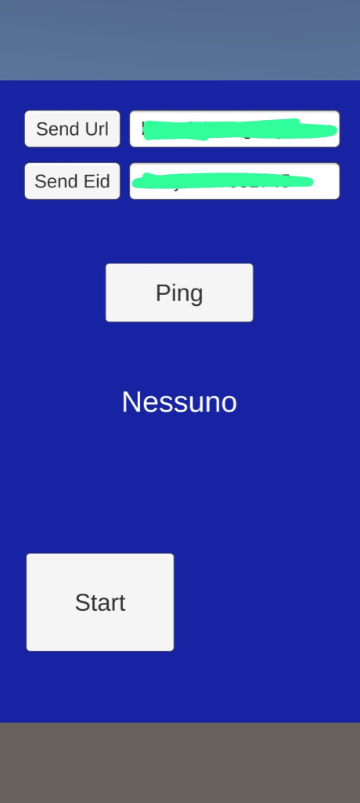
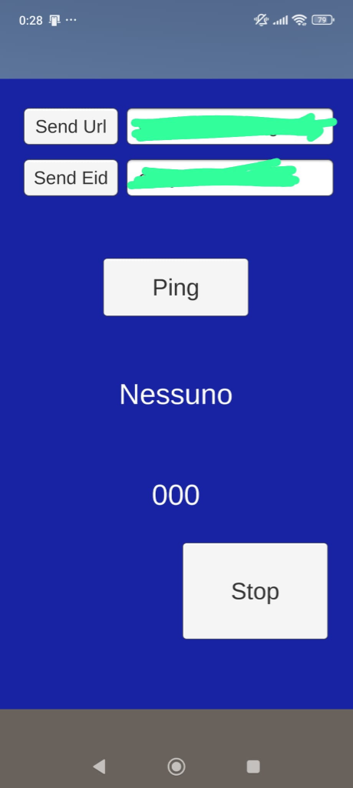
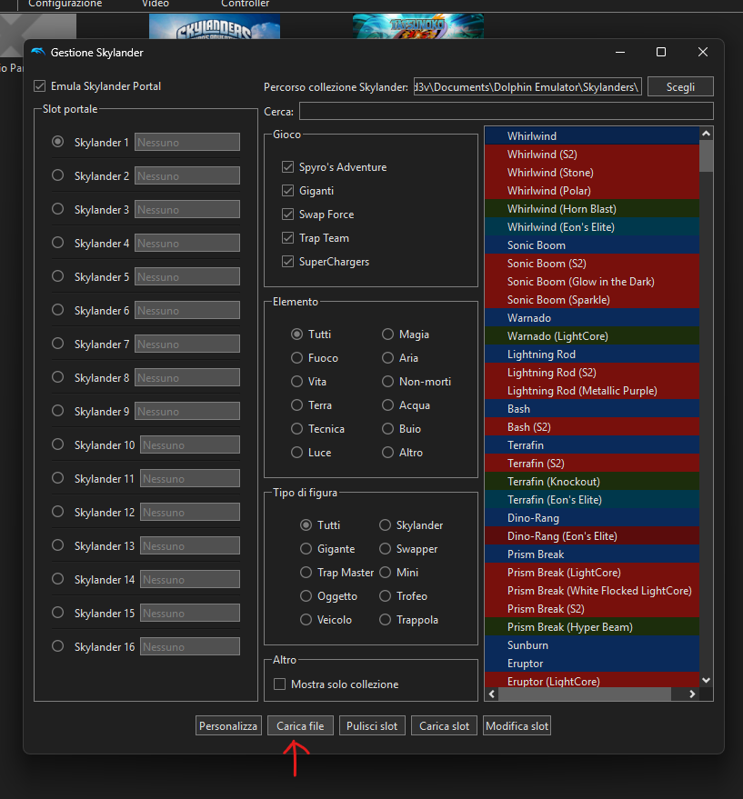
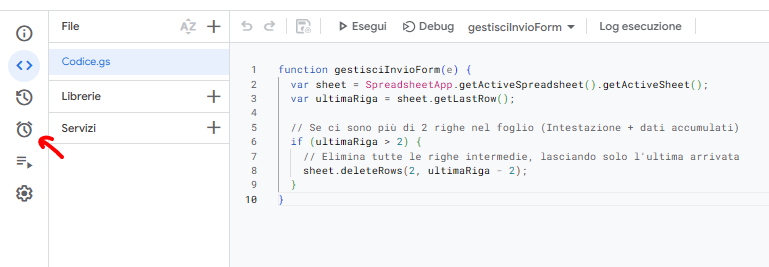
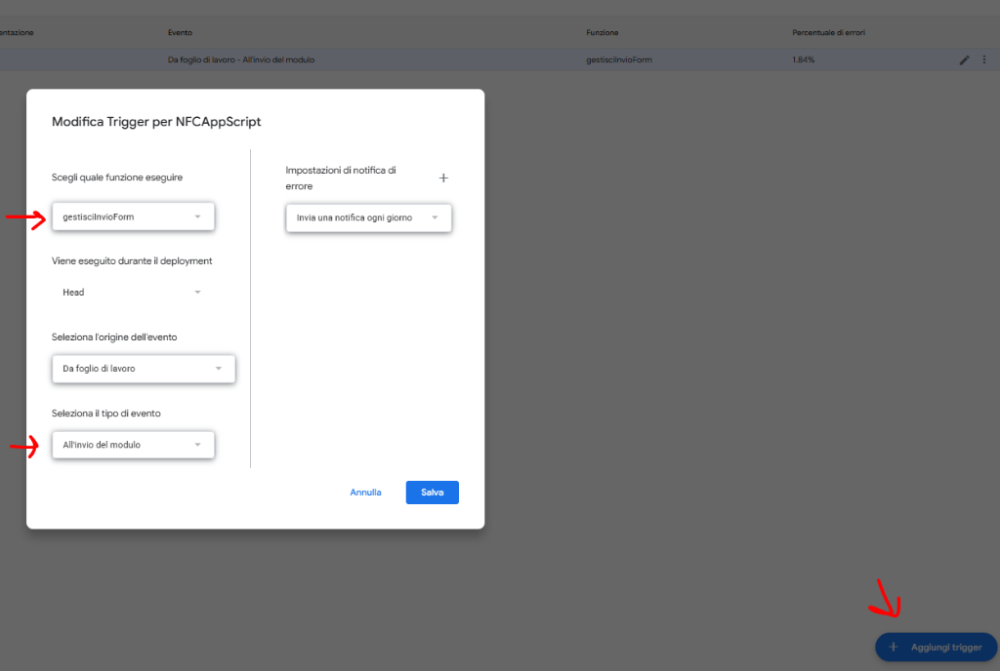

# 🌀 Unity-Android NFC Skylanders Bridge

[](https://opensource.org/licenses/MIT)
[](https://github.com)
[](https://unity.com/)
[](https://python.org/)
[](https://dolphin-emu.org/)

Turn your **NFC-enabled Android smartphone** into a real-time **Virtual Traptanium / Power Portal** for **Dolphin Emulator (PC)**. Scan physical Skylanders figures or generic NFC tags/stickers/cards with your phone to instantly spawn them in-game with zero lag and zero network setup headaches.

---

## 🌟 Showcase & Video Demo

<p align="center">
  <a href="https://youtu.be/l0NzKal-fXI" target="_blank">
    
  </a>
</p>

<p align="center">
  <a href="https://youtu.be/l0NzKal-fXI" target="_blank">
    
    
  </a>
</p>

> ℹ️ **Video Context & Presence Detection**: The demonstration shows the PC workflow in real-time. Just like a real physical portal, **the NFC tag/figure must physically remain resting on the back of the phone to stay active in-game**. When you lift/remove the tag from the phone, the Android app detects its absence in real-time and immediately instructs Dolphin to clear the portal slot!

---

### 🎮 Why this project & How it Handles Saves

- **Real-Time Continuous Presence Detection**: The app doesn't just read once on tap; it continuously checks tag presence. Place the figure on the phone $\rightarrow$ character spawns. Lift it off $\rightarrow$ character leaves the game.
- **Universal NFC Support (Figures, Cards, Stickers, Coins)**: You don't necessarily need original figures — any physical tag with a unique NFC UID (NTAG213/215/216, Mifare, Skylander chips) functions as a physical "key".
- **Decoupled Save Management (`.sky` files)**: The NFC tag is only used as a unique identifier. All character progression, level ups, stats, and gold are natively saved and managed by Dolphin inside the corresponding `.sky` dump file on your PC.
- **Zero Cost & No Physical Portal Required**: Replaces expensive and bulky USB portals with hardware you already own.

---

## 📐 Architecture & How It Works

```mermaid
flowchart LR
    A[📱 NFC Tag / Figure / Card<br><i>Must rest on phone</i>] -->|Continuous Presence Check| B[📱 Unity Android App<br><i>NFCReader.cs</i>]
    B -->|HTTP POST Request| C[☁️ Google Form<br><i>/formResponse</i>]
    C -->|Auto Triggers Apps Script| D[📊 Google Sheet<br><i>Single-row FIFO buffer</i>]
    D -->|0.5s HTTP Polling| E[💻 Python Bridge<br><i>lettore.py</i>]
    E -->|Lookup UID in JSON| F[📂 mappatura_skylander.json]
    F -->|Hot-load or Clear .sky| G[🕹️ Dolphin Emulator<br><i>Skylander Manager</i>]
```



### 💡 The "Zero-Config Cloud Broker" Design Decision
Why route through Google Forms/Sheets instead of a local HTTP/WebSocket server?
- **Zero Firewall & NAT Issues**: Works seamlessly even if your phone is on 4G/5G or a guest Wi-Fi network, and PC is on Ethernet. No port forwarding, no local IP binding, and no Windows Defender firewall popups.
- **Serverless & Free**: Requires 0 server hosting costs.
- **Extensible**: The Python listener is decoupled and can easily be adapted in the future for local sockets (Flask/FastAPI/WebSockets).

---

## 📸 Screenshots

| Android App (Start) | Android App (Active Reading) | Dolphin Skylander Manager |
| :---: | :---: | :---: |
|  |  |  |

| Google Apps Script Editor | Trigger Configuration (On Form Submit) |
| :---: | :---: |
|  |  |

---

## 🗂️ Project Structure

```text
unity-android-nfc-skylanders-bridge/
├── docs/
│   └── screenshots/              # Screenshot assets for documentation
├── Python/
│   ├── lettore.py                # Main background listener (polls Google Sheet)
│   ├── Sostitutore.py            # Windows GUI automation for Dolphin Manager
│   ├── mappatura_skylander.json  # Serial UID -> .sky dump mapping
│   ├── mappatura_skylander.example.json
│   └── requirements.txt          # Python dependencies
├── UnityProject/
│   ├── Assets/                   # Unity source files (C# scripts, Android Plugins)
│   │   ├── NFCReader.cs          # Native Android NFC reader & presence detector
│   │   ├── GoogleFormSender.cs   # HTTP POST sender for Google Forms
│   │   └── Scaler.cs             # Responsive UI Canvas scaler
│   └── Portal.apk                # Ready-to-install Android package
├── .gitignore
├── LICENSE                       # MIT License
└── README.md
```

---

## 🚀 Step-by-Step Setup Guide

### 1️⃣ Dolphin Emulator Setup (PC)
1. Open **Dolphin Emulator** (tested on modern builds such as 2606a).
2. Start your Skylanders game (e.g., *Skylanders: Spyro's Adventure*, *Giants*, *Swap Force*, *Trap Team*).
3. **Display Mode Recommendation**: Set Dolphin to run in **Windowed Full Size (Maximized Window)** rather than Exclusive Fullscreen. This ensures keyboard macros and instant window switching/focus restoration run seamlessly without video mode disruption.
4. Open the Emulated Portal window from Dolphin's top menu: **Tools > Skylander Management** (*"Strumenti > Gestione Skylander"* in Italian).
5. For each Skylander you own, create/save its `.sky` dump file to a folder on your PC (e.g. `C:\Users\<YourUser>\Documents\Dolphin Emulator\Skylanders\`).
6. ⚠️ **Critical State 0 Calibration (Focus Setup)**:
   - In the "Gestione Skylander" window, click once on the **"Carica file" (Load file)** button on Slot 1 (marked with the red arrow below).
   - When the file picker dialog opens, close or cancel it.
   - *Why?* This leaves the "Carica file" button highlighted as the active/focused GUI element (State 0), allowing the Python automation macro (`space` / `arrow keys`) to trigger reliably. Keep the "Gestione Skylander" window open in the background!

<p align="center">
  
</p>

> [!NOTE]
> `Sostitutore.py` automatically detects both Italian (`"Gestione Skylander"`) and English (`"Skylander Management"`) window titles.

---

### 2️⃣ Google Cloud Bridge Setup (Free & Zero-Config)

#### A. Create a Google Form
1. Go to [Google Forms](https://forms.google.com) and create a blank form.
2. Add a single **Short Answer** question (e.g. named `TagID`).
3. Click the three dots (⋮) top right > **Get pre-filled link**.
4. Type `TEST` into the field, click **Get link**, and copy it.
   - It will look like: `https://docs.google.com/forms/d/e/1FAIpQLSc.../viewform?usp=pp_url&entry.123456789=TEST`
5. Note down:
   - **Form Response URL**: Replace `/viewform?...` with `/formResponse` (e.g. `https://docs.google.com/forms/d/e/1FAIpQLSc.../formResponse`).
   - **Entry ID**: The `entry.123456789` parameter.

#### B. Link Google Sheet & Apps Script
1. In your Google Form, click on the **Responses** tab and click **Link to Sheets** (Create a new spreadsheet).
2. In the Google Sheet, go to **Extensions > Apps Script**.
3. Replace the code with the following snippet:

```javascript
function gestisciInvioForm(e) {
  var sheet = SpreadsheetApp.getActiveSpreadsheet().getActiveSheet();
  var ultimaRiga = sheet.getLastRow();
  
  // Keep only the header and the latest incoming row
  if (ultimaRiga > 2) {
    sheet.deleteRows(2, ultimaRiga - 2);
  }
}
```

<p align="center">
  
</p>

4. Click the clock icon on the left toolbar (**Triggers**) > **Add Trigger** (*"Aggiungi trigger"*):
   - **Function to run**: `gestisciInvioForm`
   - **Event source**: `From spreadsheet` (*"Da foglio di lavoro"*)
   - **Event type**: `On form submit` (*"All'invio del modulo"*)
   - Click **Save** and accept permissions.

<p align="center">
  
</p>

5. Make your Sheet accessible via CSV link:
   - Click **Share** > Set General Access to **"Anyone with the link can view"**.
   - Note down your **Sheet ID** (from the URL `https://docs.google.com/spreadsheets/d/<SHEET_ID>/edit`) and **GID** (usually `0` or found in the URL `#gid=...`).

---

### 3️⃣ Android App Setup
1. Install [`Portal.apk`](file:///C:/Users/ggd3v/Desktop/GitHub%20Portal/unity-android-nfc-skylanders-bridge/UnityProject/Portal.apk) on your NFC-enabled Android phone (or build the project from `UnityProject/` in Unity).
2. Open the app and enter your:
   - **Send Url**: Your Form URL (ending in `/formResponse`)
   - **Send Eid**: Your Entry ID (e.g., `entry.123456789`)
3. Tap **Send Url** and **Send Eid** (saved in `PlayerPrefs` permanently).
4. Tap **Start** to begin NFC scanning.

<p align="center">
  
  &nbsp;&nbsp;&nbsp;&nbsp;
  
</p>

---

### 4️⃣ Python PC Setup
1. Open a terminal in the `Python/` directory.
2. Install required packages:
   ```bash
   pip install -r requirements.txt
   ```
3. Edit `Python/lettore.py`:
   ```python
   SHEET_ID = "YOUR_GOOGLE_SHEET_ID"
   GID = "YOUR_GOOGLE_SHEET_GID"
   ```
4. Configure `Python/mappatura_skylander.json` with your physical tag UIDs and `.sky` paths:
   ```json
   {
     "04:75:7D:B2:58:1C:90": "C:\\Users\\YourUser\\Documents\\Dolphin Emulator\\Skylanders\\Chop Chop.sky",
     "04:AB:CD:EF:12:34:56": "C:\\Users\\YourUser\\Documents\\Dolphin Emulator\\Skylanders\\Spyro.sky",
     "Nessuno": "NULL"
   }
   ```
5. Run the listener:
   ```bash
   python lettore.py
   ```

---

## 🕹️ In-Game Routine (10 Seconds Setup)

1. Launch Dolphin and boot your Skylanders game (in **Windowed Full Size / Maximized Window**).
2. Open the **Skylander Management** window (*Strumenti > Gestione Skylander*).
3. **Calibrate State 0**: Click *"Carica file"* (Load file) once, then close/cancel the file dialog (leaves button focused).
4. Run the Python bridge:
   ```bash
   python Python/lettore.py
   ```
5. Open the Android app and tap **Start Reading**.
6. **Place a Skylander on the back of your phone**: it will instantly appear in-game!
7. **Remove the figure**: the app detects the absence and clears the portal slot automatically!

---

## 🗺️ Roadmap & Future Enhancements

- [ ] Support Player 2 / Multiple Portal Slots.
- [ ] Add optional local server backend (WebSockets / Flask) alongside Google Sheets for offline LAN play.
- [ ] GUI configuration tool for `.sky` file mapping.
- [ ] Direct Dolphin memory/pipe hook integration to eliminate GUI macro interactions.

---

## 🤝 Contributing

Pull requests and issues are welcome! Feel free to fork the repository, suggest enhancements, or report bugs.

---

## 📜 License

This project is licensed under the [MIT License](LICENSE).

*Disclaimer: This project is an independent open-source tool and is not affiliated with, endorsed by, or connected to Activision, Toys for Bob, Nintendo, or the Dolphin Emulator team.*
